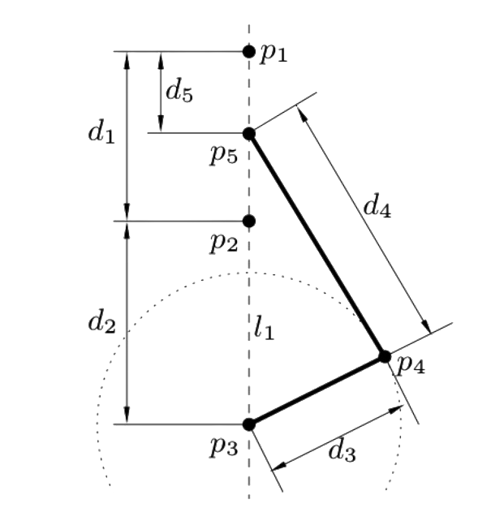
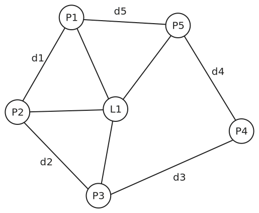
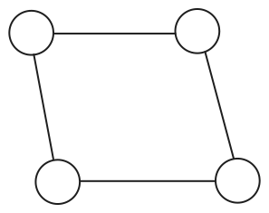
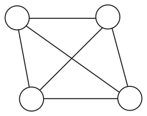
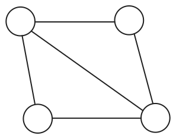
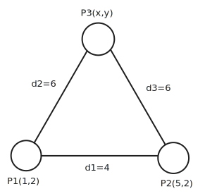
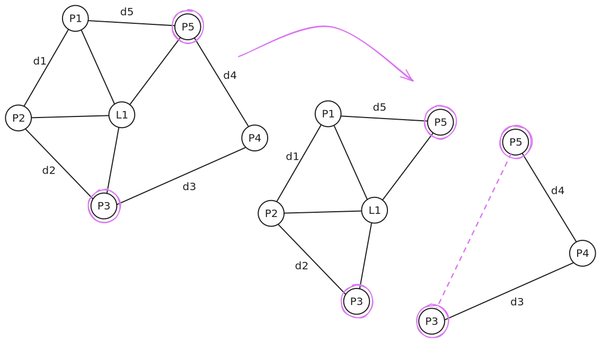
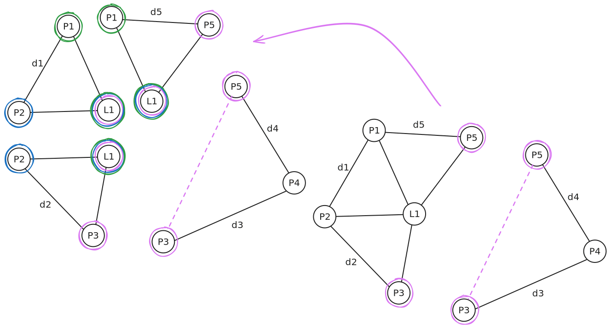

---
# try also 'default' to start simple
theme: ./academic_custom
layout: intro
background: ./pictures/engine_background.jpg
backgroundOpacity: 0.75
textColor: "#ffffff"
occasion: Shapr3D Scolarship/MSc Project Laboratory
title: 2D Geometric Constraint Solvers
authors:
  - Sólyom Bálint
coAuthors:
  - Dr. Vaitkus Márton
date: 2025.10.14
logos:
  - ./pictures/BME LOGO_2025_horizontal_black.png
  - ./pictures/VIK_LOGO_2025_horizontal_black_eng.png
  - ./pictures/iit_logo.png
# Footer configuration (applied to all slides)
footerTitle: 2D Geometric Constraint Solvers
footerOccasion: Shapr3D Scolarship/MSc Project Laboratory
addons:
  - slidev-addon-typst
  - slidev-addon-excalidraw
  - fancy-arrow
  - tldraw
---

<!--
Notes
-->

---
layout: toc
tocTitle: Agenda
background: ./pictures/engine_background.jpg
backgroundOpacity: 0.7
tocItems:
  - Introduction
  - Constraint Graphs
  - Decomposition
  - Demo
  - Technical Aspects/Architecture
  - Conclusion
---

---
layout: title-page
title: Introduction
background: ./pictures/engine_background.jpg
backgroundMode: fit
---

---
layout: image-right
title: Motivation
imageLayout: horizontal
images:
  - ./pictures/crankshaft.png
  - ./pictures/crankshaft_model.png
---

<style>
  .text-content0 {
    font-size: 1.25rem;
  }
</style>

<div class="text-content0">
<div v-click="1">

* Most models start out as a 2D sketch
* Design flaws or inconsistencies are best caught early

</div>

<div v-click="2">

* There is already a need to define the relationship of the elements on the early design
* A general geometric view of the system is needed

</div>
</div>

<!--
Notes
-->

---
layout: two-cols
title: Solving Geometric Systems
---

<div v-click="1">

* A brute force approach would be to define all of the possible equations and calculate the results

</div>

<div v-click="2">

* Newton-Raphson is a numeric iterative method for finding roots of equation systems
* It has quadratic convergence near the solution, meaning the error approximately squares with each iteration
* The final solution depends on the initial guess and may converge to different roots or diverge
* Newton-Raphson becomes computationally expensive for large systems with high-degree nonlinearities

</div>

::right::

<div v-click="1">
```typst
#set text(16pt)
$
cases(
  (x_(p_2) - x_(p_1))^2 + (y_(p_2) - y_(p_1))^2 = d_1^2,
  
  (x_(p_3) - x_(p_2))^2 + (y_(p_3) - y_(p_2))^2 = d_2^2,
  
  (x_(p_4) - x_(p_3))^2 + (y_(p_4) - y_(p_3))^2 = d_3^2,
  
  (x_(p_5) - x_(p_4))^2 + (y_(p_5) - y_(p_4))^2 = d_4^2,
  
  (x_(p_5) - x_(p_1))^2 + (y_(p_5) - y_(p_1))^2 = d_5^2,
  
  x_(p_1) n_(1_x) + y_(p_1) n_(1_y) = r_1,
  
  x_(p_2) n_(1_x) + y_(p_2) n_(1_y) = r_1,
  
  x_(p_3) n_(1_x) + y_(p_3) n_(1_y) = r_1,
  
  x_(p_4) n_(1_x) + y_(p_4) n_(1_y) = r_1
)
$
```

</div>

---
layout: title-page
title: Constraint Graphs
background: ./pictures/engine_background.jpg
backgroundMode: cover
---

---
layout: two-cols
title: Constraint Graph Basics
---

<style>
  .text-content1 {
    font-size: 1.0rem;
  }
</style>

<div class="text-content1">
<div v-click="1">

A new data structure that stores the relationships of the system:
* Nodes represent **geometric elements** such as points, lines, fixed radius circles
* Edges represent **constraints** between elements such as distance, tangency

</div>

<div v-click="2">

* Example constraint graph configuration for the crankshaft:
  * Geometrical elements: Points, Lines
  * Geometrical constraints: Point-Point distance, Point-On-Line

</div>
</div>

::right::

<div v-click="1">

</div>

<style>
.center {
  display: block;
  margin-left: auto;
  margin-right: auto;
  width: 50%;
}
</style>

<div v-click="2">
<FancyArrow from="(800, 250)" to="(800, 400)"  arc="0.5" color="purple" animation-duration="2000"/>
</div>

<div v-click="3">
<div style="display: flex; justify-content: center; align-items: center; height: 100%;">
    
</div>
</div>

---
layout: two-cols
title: Constraint Graph Properties
---

There are different types of constraint graphs:

<div v-click="1">

* **Under-constrained**: The system loses its form during transformations, the corresponding equation system has infinite solutions

</div>

<div v-click="2">

* **Over-constrained**: The system may have conflicting constraints, rendering the system unsolvable

</div>

<div v-click="3">

* **Well-constrained**: The system maintains its form during transformations (it's rigid), it has a finite number of solutions

</div>

::right::

<div v-click="1">
<div style="display: flex; justify-content: center; align-items: center; height: 100%;">
    
</div>
</div>

<div v-click="2">
<div style="display: flex; justify-content: center; align-items: center; height: 100%;">
    
</div>
</div>

<div v-click="3">
<div style="display: flex; justify-content: center; align-items: center; height: 100%;">
    
</div>
</div>

---
layout: title-page
title: Decomposition
background: ./pictures/engine_background.jpg
backgroundMode: cover
---

---
layout: two-cols
title: Need for Decomposition
---

<style>
  .text-content2 {
    font-size: 1.2rem;
  }
</style>

<div class="text-content2">

* Constraint Graphs carry every necessary structural information about the system
* This allows us to decompose the graph to smaller systems
* Solving such sub-systems is substantially faster

<div v-click="1">

* Example: Solving a decomposed triangle with two already calculated nodes

</div>
</div>

::right::

<div v-click="1">
<div style="display: flex; justify-content: center; align-items: center; height: 100%;">
    
</div>

```typst
#set text(16pt)
$
cases(
  (x - 1)^2 + (y - 2)^2 - 36 = 0,
  
  (x - 5)^2 + (y - 2)^2 - 36 = 0,
)
$
```
</div>

---
layout: two-cols
title: Top-down Decomposition
columnRatio: "3:5"
clicks: 4
---

<style>
  .text-content3 {
    font-size: 0.9rem;
  }
</style>

<div class="text-content3">

Owen's top-down algorithm decomposes the constraint graph into triangles:
* Input graph should be biconnected
* Search for articulation/separation pairs

<div v-click="1">

* Split the graph at the separation pairs by duplicating the pair in the subgraphs and inserting virtual edges as necessary
  * Virtual edges are inserted if one of the created subgraph loses its rigidity because of the decompostion

</div>
</div>

::right::

<div style="position: relative; min-height: 400px;">
  <Transition name="fade">
    
  </Transition>
  <Transition name="fade">
    
  </Transition>
  <Transition name="fade">
    = 4" 
      src="./svgs/crank_full_no_embed.svg" 
      style="position: absolute; width: 550px; height: 400px; left: 50%; top: 50%; transform: translate(-50%, -50%);">
  </Transition>
</div>

<style scoped>
.fade-enter-active, .fade-leave-active {
  transition: opacity 0.4s ease;
}
.fade-enter-from, .fade-leave-to {
  opacity: 0;
}
</style>

<!-- <div class="overlap-wrapper"> -->
<!--   <div style="position: relative; min-height: 400px;"> -->
<!--     <div v-click.hide="1" style="position: absolute; top: 0; left: 0; width: 100%;"> -->
<!--       <div style="display: flex; justify-content: center; align-items: center;"> -->
<!--          -->
<!--       </div> -->
<!--     </div> -->
<!--     <div v-click="1" v-click.hide="2" style="position: absolute; top: 0; left: 0; width: 100%;"> -->
<!--       <div style="display: flex; justify-content: center; align-items: center;"> -->
<!--          -->
<!--       </div> -->
<!--     </div> -->
<!--     <div v-click="2" style="position: absolute; top: 0; left: 0; width: 100%;"> -->
<!--       <div style="display: flex; justify-content: center; align-items: center;"> -->
<!--          -->
<!--       </div> -->
<!--     </div> -->
<!--   </div> -->
<!-- </div> -->

---
layout: title-page
title: Demo
background: ./pictures/engine_background.jpg
backgroundMode: cover
---

---
layout: title-page
title: Technical Aspects
background: ./pictures/engine_background.jpg
backgroundMode: cover
---

---
layout: default
title: Pipeline
---

* **Detector**: Evaluates the well-formedness of the input constraint graph 
* **Resolver**: Updates the model so that it is well-constrained
* **Decomposer**: Decomposes the input graph
* **Solver**: Solves the subgraphs and reconstructs the original system 

<div style="display: flex; justify-content: center; margin-top: 0.1rem;">
  
</div>

---
layout: default
title: Implemented Algorithms&Technologies
---

<style>
  .text-content3 {
    font-size: 0.9rem;
  }
</style>

<div class="text-content3">


<div v-click="1">

The project was constructed with modern approaches and developers in mind:
* Tech stack: C++20, gcc15+, CMake 4.+, conan2
* A declarative development environment is guaranteed by the Nix based devenv.sh project
* Takes a few minutes to set up, build and develop on any Unix based system 
* Modular architecture with both compile-time and run-time configuration options

</div>

<div v-click="2">

The project currently has implementations for:
* A wrapper and additional functionality for the Open Graph Drawing Framework (OGDF) project
* A Newton-Raphson method implementation that is capable of solving quadratic equation systems with with two unknowns
using AutoDiff
* Triangle orientation based heuristics which helps to choose the intended result for numeric iterative methods
* Top-down constraint graph decomposition algorithm based on Owen's algorithm (there are slight differences at the
moment)

</div>
</div>
